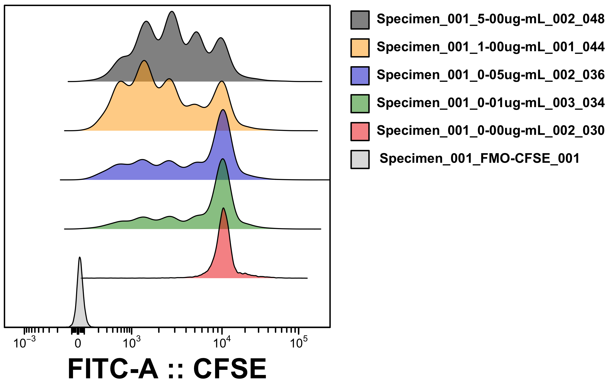

<!-- README.md is generated from README.Rmd. Please edit that file -->

# BCyto 

<!-- badges: start -->
<!-- badges: end -->

**BCyto** is an open-source project that provides an user-friendly,
high-performance interface for Flow Cytometry analysis in R.

## Installation

**BCyto** can be installed by first installing R (\>= 4.2.0) and typing
the following commands in the R console:

``` r
#allowing installation of GitHub packages
install.packages("devtools")
#enabling donwload of BioConductor dependencies
install.packages("BiocManager")
#installing BCyto
devtools::install_github("BonilhaCaio/BCyto")
```

*Note: as Bioconductor currently does not support the Apple M1 (a.k.a.
arm64) architecture in native mode, BCyto requires the Intel 64-bit R
version (x86_64 arch) to work in Apple M1 computers. When downloading R
from CRAN, please choose R-x.x.x.pkg, and not R-x.x.x-arm64.pkg.*

## Usage

**BCyto** Shiny-based user interface with all its tools is generated
through the package’s single function:

``` r
BCyto::runBCyto()
```

## User Guide

**BCyto** will initially be opened in the *File* tab, where the user can
load FCS files or a BCyto file, which contains all saved data from a
previous analysis.

-   In the example below, a BCyto file from a [test
    dataset](http://github.com/BonilhaCaio/test-data-1) was uploaded. In
    the *Plot* tab, the user can generate dot plots, contour plots or
    histograms under selection of parameters such as sample and
    parameter. For the selection of desired populations, gates can be
    drawn directly in the plot with the use of rectangle, polygon,
    quadrant or interval tools. The gate hierarchy is shown in the
    *Parent* section in a second interactive plot.


-   The compensation can be checked in the *Compensation* tab, as shown
    below. For addressing compensation issues to improve the quality of
    the analysis, new matrices can be automatically generated with
    [AutoSpill](https://doi.org/10.1038/s41467-021-23126-8) or manually
    created through the interactive table.

<center>

</center>

-   Backgating based on the hierarchy of gates generated from user input
    can be easily visualised in the *Ancestry plots* tab under selection
    of the desired sample and population.

<center>

</center>

-   Overlaid or offset histograms for the generation of representative
    data can be created through the *Overlays* tab.

<left></left>


-   The *Proliferation* tab provides automated detection and
    quantification of division peaks from assays with cell proliferation
    dyes.

<center>

</center>

-   Plots such as the one below are generated using the *t-SNE* tab.
    Concatenation is performed within the software under quick selection
    of samples and does not require re-upload of external files.
    Highlights can be markers, populations or previous delimited groups.

<center>

</center>

-   Finally, quantifiable data can be selected, visualised and exported
    through the *Results* tab.

<center>

</center>

## Credits and citation

To cite **BCyto** in publications, please use:

Bonilha CS. BCyto: A shiny app for flow cytometry data analysis.
Molecular and Cellular Probes (2022), doi:
<https://doi.org/10.1016/j.mcp.2022.101848>
